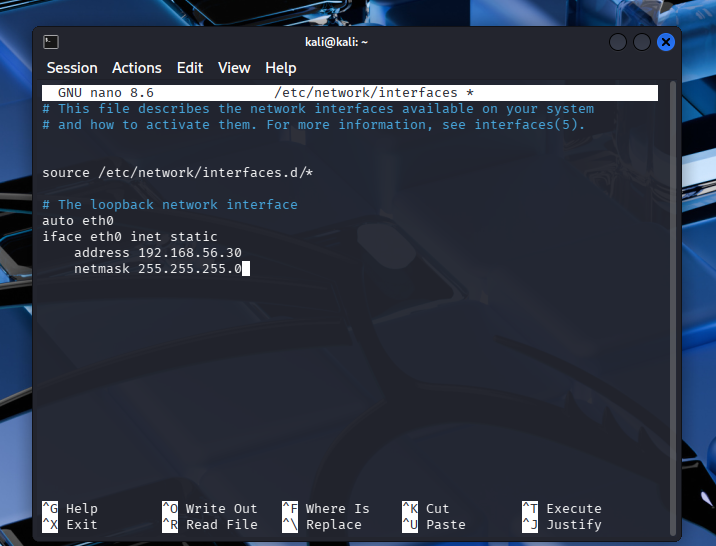
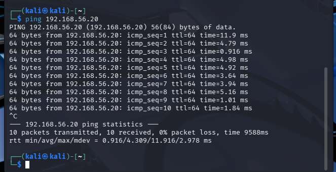
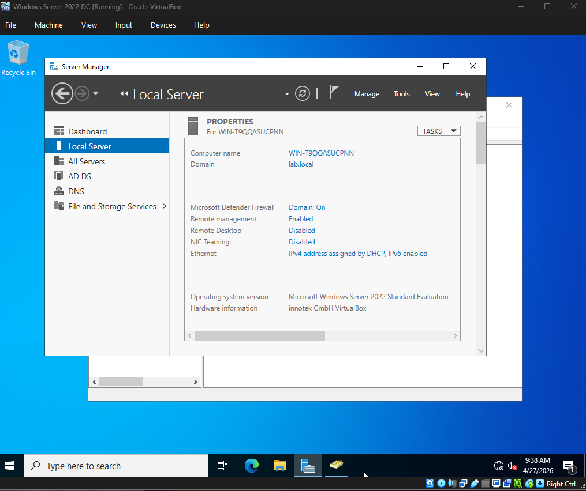
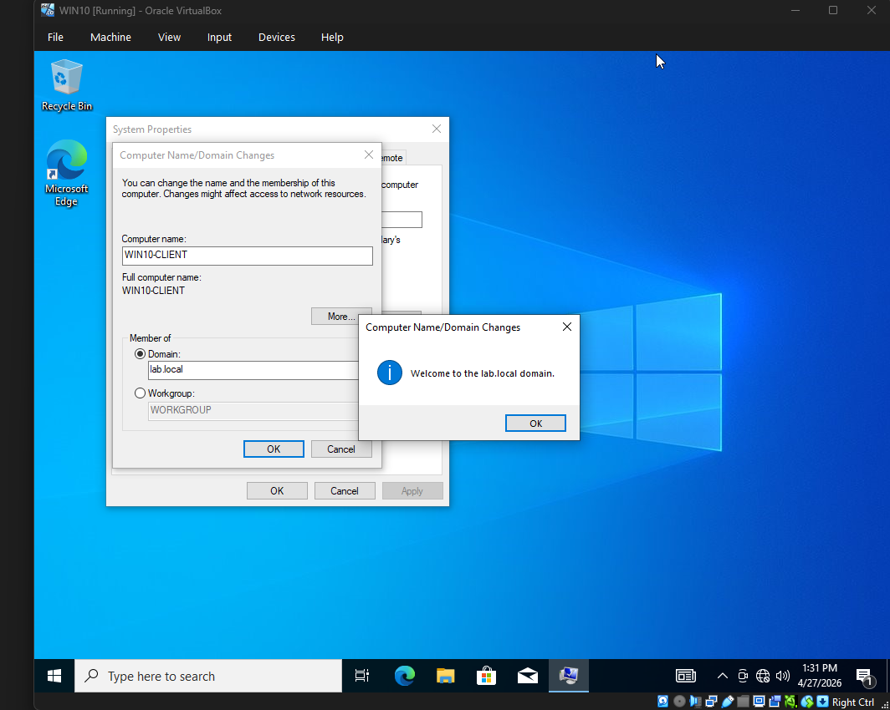
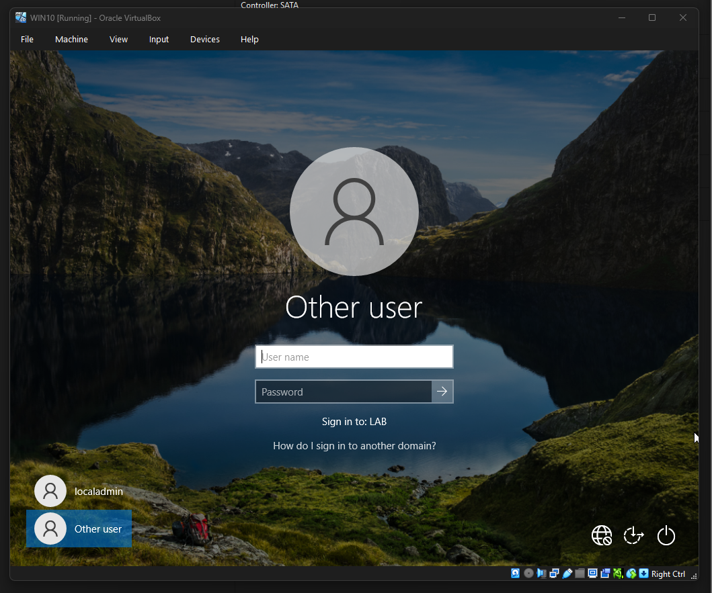

# 🖥️ Active Directory Home Lab

## 📌 Overview

This project demonstrates how to set up a virtualized enterprise-style lab environment using Windows Server, Kali Linux, and Ubuntu.

The lab is designed to simulate a basic corporate network for practicing:

* System administration
* Network configuration
* Cybersecurity fundamentals

---

## 🧱 Lab Environment

| System              | Role              | IP Address    |
| ------------------- | ----------------- | ------------- |
| Windows Server 2022 | Domain Controller (DC) | 192.168.56.10 |
| Windows 10 Client   | Domain-joined Machine | 192.168.100.10
| Ubuntu Linux        | SIEM (Splunk - planned)    | 192.168.56.20 |
| Kali Linux          | Security Testing  | 192.168.56.30 |

* **Platform:** VirtualBox
* **Network Type:** Internal Network (Isolated)
* **Subnet:** 192.168.56.0/24
* **Additional Network**: NAT (Ubuntu only for internet access)

---

## 🎯 Objectives

* Build a fully functional Active Directory domain environment
* Configure static IP addressing and DNS resolution
* Join a Windows 10 client machine to the domain
* Validate domain authentication using Active Directory credentials
* Establish a foundation for centralized logging and security monitoring
* Establish network communication between systems
* Prepare the environment for Active Directory deployment and security testing

---

## ⚙️ Configuration

### Network Setup

* Created an isolated internal network in VirtualBox
* Disabled DHCP and manually assigned IP addresses
* Ensured all machines are on the same subnet

### Linux IP Configuration Example

```bash
sudo ip addr add 192.168.56.20/24 dev eth0
sudo ip link set eth0 up
```

### Connectivity Testing

* Verified communication using `ping`
* Confirmed successful host-to-host communication across all systems

---

## 🧪 Validation

✔ Successful network connectivity between all systems  
✔ Windows 10 client successfully joined the domain  
✔ Domain authentication confirmed using LAB\labuser  
✔ DNS resolution verified between client and Domain Controller  
✔ Communication confirmed via: ping 192.168.100.5  

---

## 📸 Screenshots


*Configured static IP for internal network communication*


*Verified connectivity between systems*


*Domain lab.local configured in Active Directory*


*Windows 10 successfully joined to domain*


*Authenticated using LAB\labuser*

Additional screenshots available in the /screenshots directory.


---

## 📚 Skills Demonstrated

* Virtual machine deployment and management
* Network configuration (IP addressing, subnetting)
* Linux command-line networking
* Troubleshooting connectivity issues
* Environment setup for cybersecurity testing

---

## 🚧 Project Status

* [x] Virtual machines deployed
* [x] Network configured (static IPs)
* [x] Connectivity verified
* [x] Active Directory Domain Services (AD DS) setup
* [x] Domain user and group management
* [x] Domain join-Windows 10 joined (client machines)
* [x] Domain authentication validated

---

## 🚀 Next Steps

* Install and configure Active Directory Domain Services
* Promote Windows Server to Domain Controller
* Join Ubuntu/Windows clients to the domain


---

## 🧠 Key Takeaway
* Built and deployed a fully functional Active Directory domain environment
* Understood the critical role of DNS in domain-based authentication
* Configured and troubleshot static IP addressing in an isolated lab network
* Successfully joined a client machine to a domain and validated authentication
* Implemented a segmented lab design using Internal Network (LABNET) and NAT
* Gained hands-on experience diagnosing network issues such as APIPA addressing and DNS misconfiguration
* Established a foundation for SIEM integration and security monitoring


