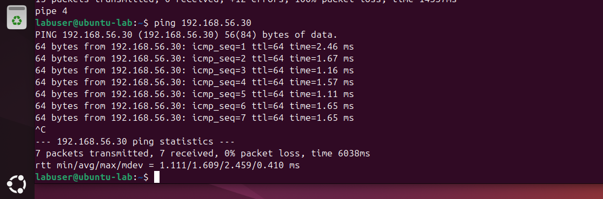

# Network Connectivity Validation (Kali ↔ Ubuntu)

## Objective

Validate communication between virtual machines in an isolated internal network by configuring Kali Linux with a static IP and performing bidirectional connectivity tests.

---

## Initial State

* Kali Linux connected to the same **Internal Network (intnet)** as Ubuntu
* Network interface `eth0` present but no IPv4 address assigned
* No communication possible between machines

---

## Steps Performed

### 1. Verify Network Interface (Kali)

Command:

```bash
ip a
```

Observation:

* `eth0` interface is present
* No IPv4 address assigned

---

### 2. Assign Static IP Address (Kali)

Command:

```bash
sudo ip addr add 192.168.56.30/24 dev eth0
```

Explanation:

* Assigns static IP `192.168.56.30`
* Uses the same subnet as Ubuntu (`192.168.56.0/24`)

---

### 3. Enable Network Interface

Command:

```bash
sudo ip link set eth0 up
```

Explanation:

* Activates the interface to allow communication

---

### 4. Verify IP Assignment

Command:

```bash
ip a
```

Result:

```text
inet 192.168.56.30/24
```

---

### 5. Test Connectivity (Kali → Ubuntu)

Command:

```bash
ping 192.168.56.20
```

Result:

* Successful replies received from Ubuntu
* Confirms communication from Kali to Ubuntu

---

### 6. Test Connectivity (Ubuntu → Kali)

Command:

```bash
ping 192.168.56.30
```

Result:

* Successful replies received from Kali
* Confirms bidirectional communication

---

## Screenshot Evidence

### Kali Static IP Assigned


### Kali → Ubuntu Ping


### Ubuntu → Kali Ping



---

## Key Takeaways

* Devices must be on the same subnet to communicate directly
* Static IP configuration is required in isolated internal networks
* Bidirectional ping confirms full network connectivity
* Manual configuration reinforces understanding of networking fundamentals

---

## Conclusion

Successful communication between Kali Linux and Ubuntu confirms that both systems are properly configured within the internal network and are ready for further lab development.
